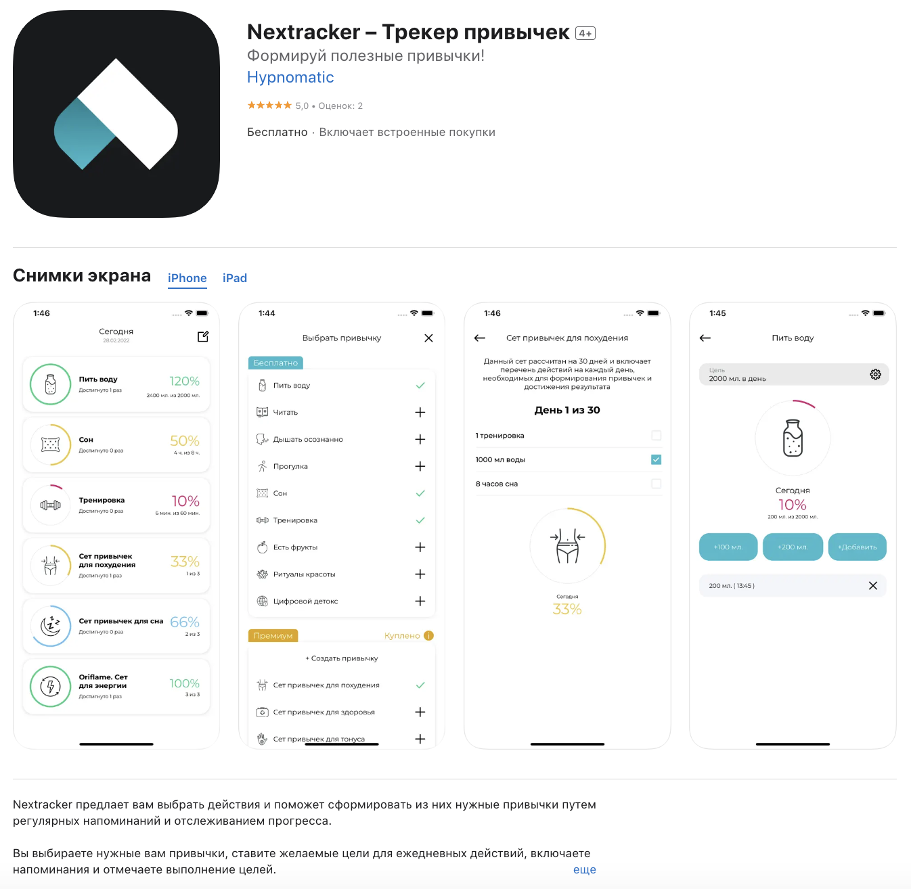

## Nextracker - Трекер привычек

**Задача:**\
Вам предлагается протестировать Nextracker — приложение для закрепления полезных привычек.

[📎 Ссылка для iOS](https://apps.apple.com/ru/app/nextracker-%D1%82%D1%80%D0%B5%D0%BA%D0%B5%D1%80-%D0%BF%D1%80%D0%B8%D0%B2%D1%8B%D1%87%D0%B5%D0%BA/id1609916479) 
[📎 Ссылка для Android](https://play.google.com/store/apps/details?id=com.alef.nextracker&pli=1)

**Этапы выполнения кейса:**

**Шаг 1.**\
Выполните следующие задания:\
**Задание 1.** Сделайте чек-лист для проверки приложения. Платные функции покупать не нужно, но нужно отразить их в проверках.\
**Задание 2.** Выберите конкретную привычку и распишите для нее тест-кейсы.\

**Шаг 2.**\
Создайте документ в Google Sheets или Google Docs и выполните в нём оба задания.

**Шаг 3.**
- Установите к документу с выполненным заданием настройки доступа «По ссылке» и права — «Просмотр».
- Прикрепите ссылку на выполненное задание.